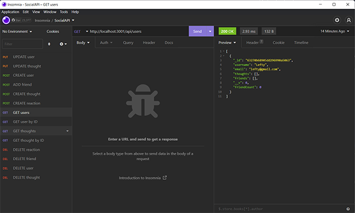

  
  # Social API
  
  ## Table of Contents
  * [Description](#description)
  * [Installation](#installation)
  * [Usage](#usage)
  * [Contributing](#contributing)
  * [Guidelines](#guidelines)
  * [Tests](#tests)
  * [License](#license)
  * [Questions](#questions)
---

  ## Description
  This is a backend server configured for use with a social network. All end points are functional and allow the options to create users and thoughts, add friends, and react to thoughts. Users and thoughts can be modified/updated, and you can view all users/thoughts or choose to view specific queries, with the ability to delete all reactions, friends, thoughts and users. 

  Created using mongodb and node.js, utilizing the express package and mongoose - an npm that allows easier operation and access of mongoose databases to perform CRUD operations on the server.

---

---

  ## Installation
   Visit the repository at [my github](https://github.com/mleftwich/SocialAPI) and clone the repo to your local machine.

  ## Usage
   Install npm(npm install in terminal) and use program like Insomnia/Postman to handle requests/endpoints.

  ## Contributing
   If you'd like to contribute, reach out through the email listed below.

  ## Guidelines
  Uses MongoDB - must have an instance on local machine to operate.

  ## Tests
  Tested endpoints with Insomnia.

  ## License
   Licensed under [MIT](https://opensource.org/licenses/MIT) 

   ---

  ## Questions
   For any questions you can find me at [GitHub](https://github.com/mleftwich) or email me at [mleftwich@live.com](mailto:mleftwich@live.com) 
